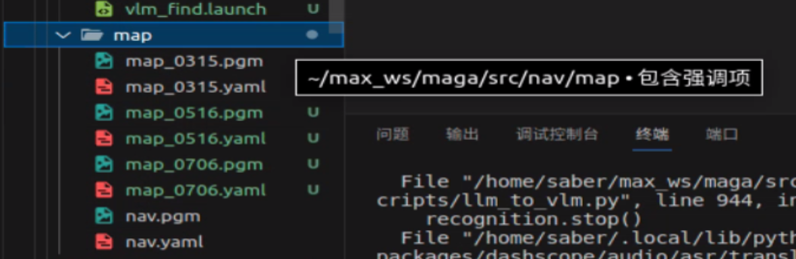
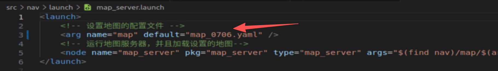
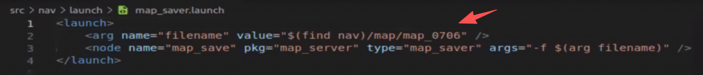
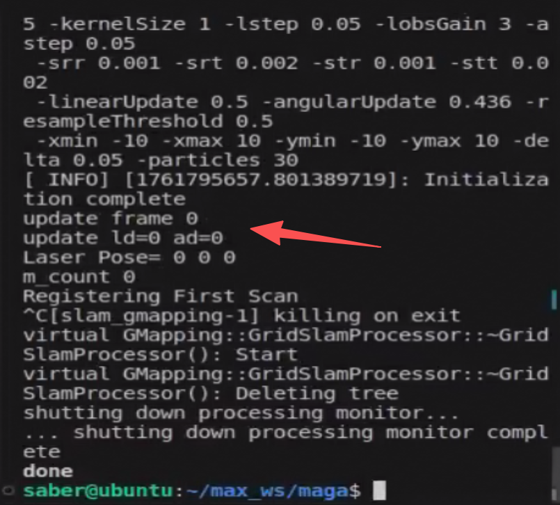
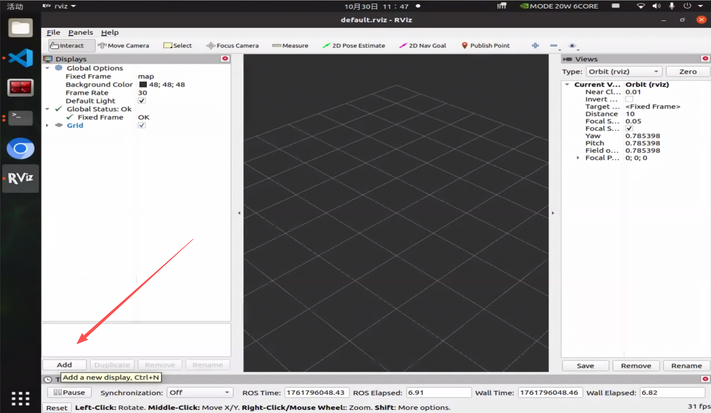
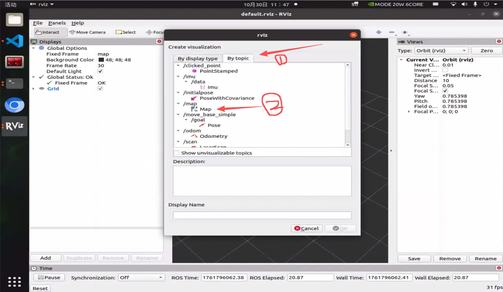
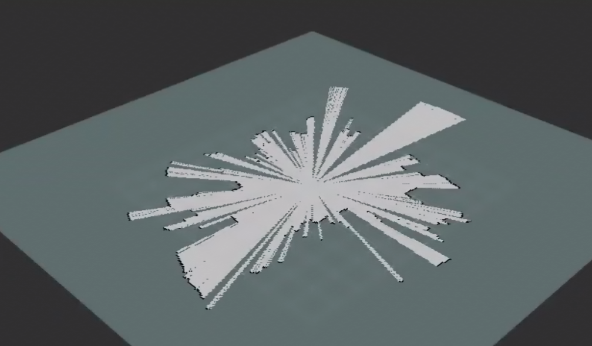
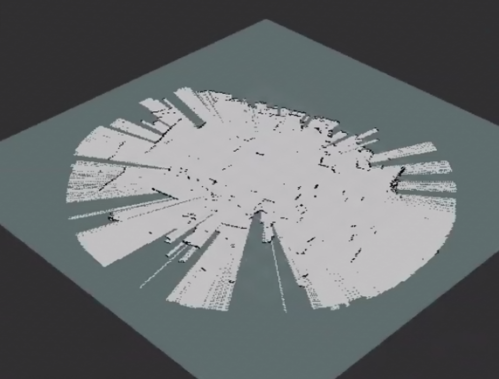

# 初代机2D雷达建图

## 建图前置信息

使用gmapping进行建图需要保证存在 `odom -> laser`的TF变换，即启动 `rosrun service_pkg odom.py`，这个代码会同时启动电机和初始化里程计odom。

在启动了odom之后，需要进行遥控操作建图，`rosrun service_pkg key_scans.py`打开节点后再这个终端里面wsad进行遥控，按下x停止。

在保证打开里程计和遥控节点之后，就可以实验gmapping进行slam建图了。

首先需要注意的是地图的存放路径：`src/nav/map`。这里面存着目前有的所有地图。

需要更换地图时，只需要修改 `src/nav/launch/map_server.launch`下的 `<arg name="map" default="map_0706.yaml" />`，需要注意的是，必须保证地图对应的png和yaml同时存在并且名称一致。

## Gmapping建图

确定好需要保存地图的名称，在 `src/nav/launch/map_saver.launch`中修改。

首先初始化电机雷达imu，`roslaunch nav self_init.launch`，然后启动gmapping节点 `roslaunch rplidar_ros gmapping.launch`，正常启动的话会有如下信息：

此时已经开始建图了，接下来只需要打开遥控节点 `rosrun service_pkg key_scans.py`走几步把整个地图显示出来就好。打开 `rviz`调整出地图观看（在终端直接输入rviz就好）。

出现下面这种地图说明移动太快了也可能是参数问题：

