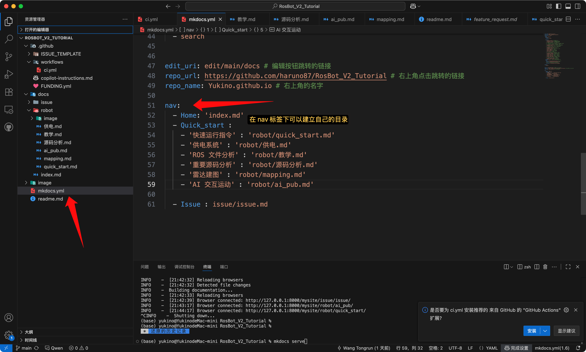
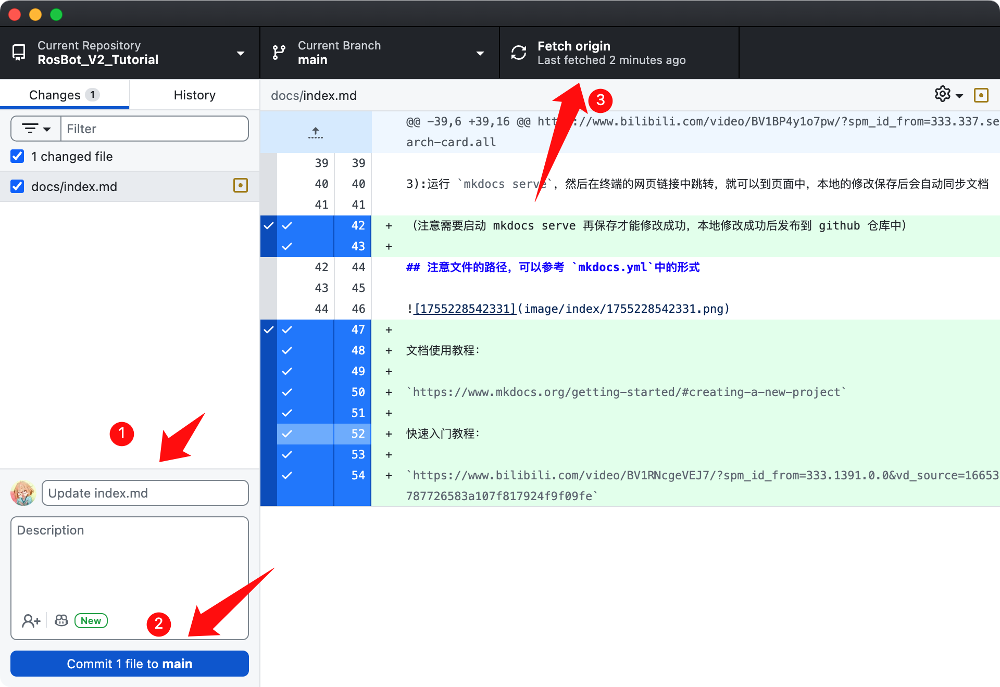

# 前言

此手册默认已有一定的 ros 基础以及 liunx 基础

下面给出速通教程,此教程可以大致了解 ros 的工作原理以及通信原理

```
https://www.bilibili.com/video/BV1zt411G7Vn/?spm_id_from=333.337.search-card.all.click&vd_source=16653787726583a107f817924f9f09fe
```

在此基础上如果需要对特定的章节知识需要补充，可以专门挑选特定章节补充

```
https://www.bilibili.com/video/BV1Ci4y1L7ZZ/?spm_id_from=333.337.search-card.all.click&vd_source=16653787726583a107f817924f9f09fe
```

[
]()

下方博客也可以时常拿出来对照开发

```
http://www.autolabor.com.cn/book/ROSTutorials/chapter1.html
```

这个视频也是很好的补充：

```
https://www.bilibili.com/video/BV1BP4y1o7pw/?spm_id_from=333.337.search-card.all.click&vd_source=16653787726583a107f817924f9f09fe
```


# 如何添加/修改文档

1):首先将仓库 clone 到本地

2):在终端运行 `pip install mkdocs`按照依赖

3):运行 `mkdocs serve`，然后在终端的网页链接中跳转，就可以到页面中，本地的修改保存后会自动同步文档

（注意需要启动 mkdocs serve 再保存才能修改成功，本地修改成功后发布到 github 仓库中）

## 注意文件的路径，可以参考 `mkdocs.yml`中的形式





文档使用教程：

`https://www.mkdocs.org/getting-started/#creating-a-new-project`

快速入门教程：

`https://www.bilibili.com/video/BV1RNcgeVEJ7/?spm_id_from=333.1391.0.0&vd_source=16653787726583a107f817924f9f09fe`
