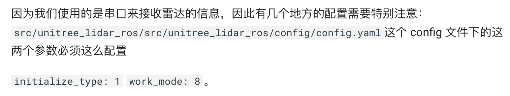
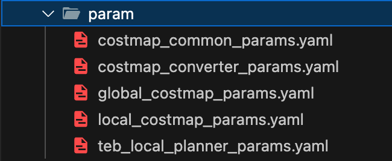
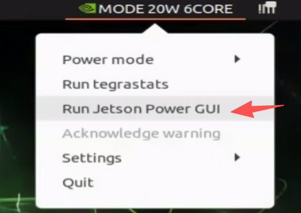

# 二代机

## 1. 为什么3d雷达在转但是运行节点接收不到数据？

1）：确保配置正确

2）：确保供电电压稳定

3）：确保雷达不要过热

4）：检查串口接线有没有松动

## 2. 为什么3d导航避障效果不好

1）：检查这几个 move_base 中的坐标系配置，调整 global frame 和 local frame 找到效果最好的选择。

2）：由于 2d 建图和 3d 建图产生的栅格地图尺寸不同，不可以直接替换。

## 3.为什么电机不动？

二代机的电机端口与usb实际物理接口绑定，需要保证左右电机都插在对应的口上，也可以重新进行绑定。

# 初代机

## 1.为什么开机或者运行一段时间就自动关机？

功率过大导致板卡自动保护了，开机时电流较大，不宜插太多外设，建议开机后再插上音响和imu，可以在主界面右上角的图形化界面查看当前功率：

## 2.为什么电机只有一个转或者两个都不转

由于一代机使用的是一路usb转两路485，需要这两个设备占用ttyUSB0和ttyUSB1，为了保证这样的端口不被占用，可以开机前先不插IMU，开机后再插上，这样就可以保证电机端口不被占用。而且IMU的端口已经重映射，不需要在意imu的端口信息。
