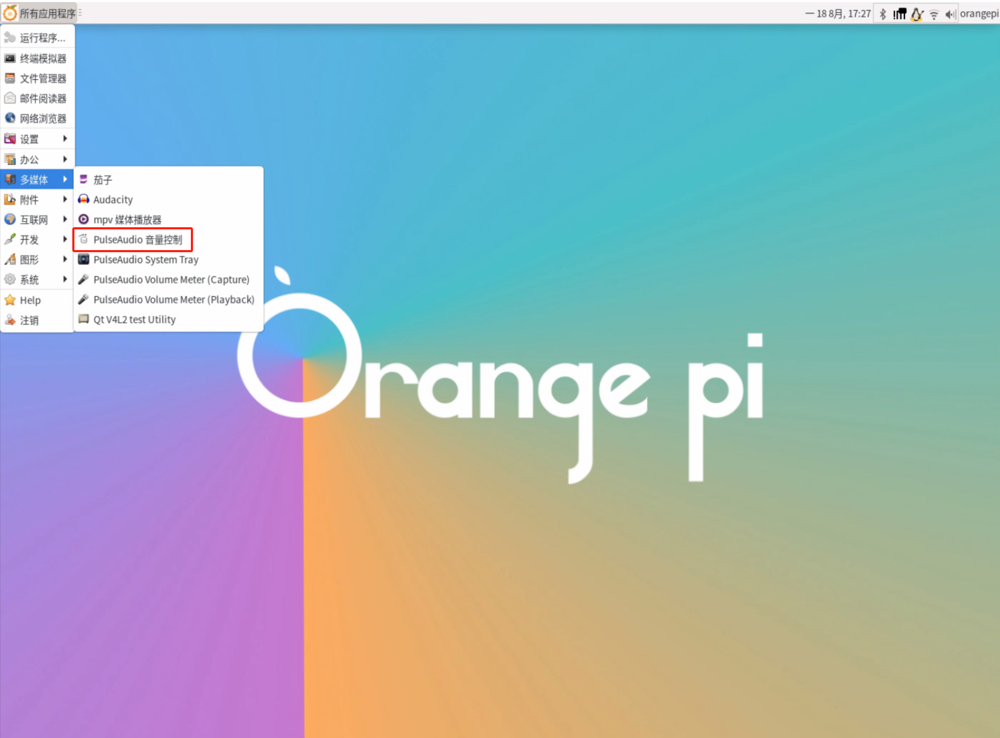
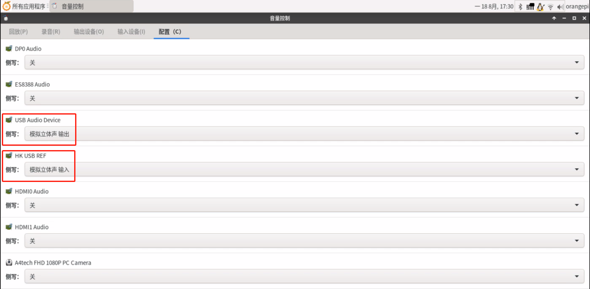

# 康养机器人多模态交互软件
## 1.项目结构
1. `snowboydetect.py` 语音唤醒依赖代码
2. `voice_capture.py` 继承语音唤醒以及录音相关代码
3. `camera_capture` 拍照代码
4. `text_voice.py` 语音转文字以及文字转语音代码
5. `playaudio.py` 播放音频代码
6. `function.py` function call相关函数、调用大模型api函数以及一些工具函数代码代码
7. `call_sms.py` 拨打电话以及发送短信代码
8. `init_info.py` 初始化信息代码
9. `self_evolution.py` 自进化相关代码
10. `app.py` 康养机器人日志看板后端代码
11. `main.py` 主程序
12. `robot_face_seting`机器人表情设置代码
13. `all_messages.json` prompt以及上下文信息
14. `data.json` 用户的基本信息
15. `function.json` function call函数列表
16. `logs.html` 康养机器人日志看板前端

## 2.多模态交互流程
1. 唤醒——唤醒词：小康
2. 唤醒后自动录音并启动一个线程进行拍照保存
3. 用户说话停止后保存录音文件
4. 将录音文件调用百度api转文本
5. 将文本发送至百度大模型，大模型根据用户意图选择调用function或者直接回答
6. 如果模型直接回答，则调用文本转语音api，并播放语音；否则调用完function，再回复


## 3. 如何运行
1. 在浏览器登入阿里云云联络中心,直接打开历史记录所有标签页登入即可,登录时需要验证吗,将离线状态改为在线状态即可

2. 运行康养机器人日志看板 
   ```
   python3 app.py
   ```
    然后在同一局域网下用浏览器浏览`192.168.1.48:5000`即可打开日志看板

3. 运行主程序
    ```
   python3 main.py
    ```
    终端会输出：
    ```
    开始监听唤醒词... (按Ctrl+C退出)
    唤醒词检测线程已启动
    ```
    代表唤醒程序启动成功，这时便可测试

4. 运行机器人表情ui（需要进入robot_ui_cpp目录）
    ```
    ./robot
    ```

## 4.调试
   1. 初始化消息功能
        运行`main.py`文件会自动初始化消息，即删除除prompt以外的数据，如果需要禁用，请注释掉`main.py`文件中的`initialize_files()`
   2. 唤醒功能
        唤醒功能采用的是snowboy唤醒方案，该唤醒方案对用户声音以及麦克风的要求比较严格，需重新录制唤醒模型替换目录下面的`xiaokang.pmdl`文件，命名可以修改（但是需要在`voice_capture.py`进行对应修改）
        录制唤醒模型网址如下：
        ```
        https://snowboy.hahack.com/
        ```
        唤醒功能主要调试参数为`voice_capture.py`中的(灵敏度越高唤醒越容易)：
        ```
        SENSITIVITY = 0.45# 灵敏度(0-1)
        ```

   3. 录音功能
        录音功能相关参数如下（`voice_capture.py`中）：
        ```
        MIN_USEFUL_FRAME = 36 # 无效语音帧数

        self.max_silence_frames = 15
        self.energy_threshold = 1200
        ```

        1200（`energy_threshold`）为录音能量阈值，当用户的声音能量连续15（`max_silence_frames`）帧低于该值时，会停止录音。当用户说话的录音帧数低于36（`MIN_USEFUL_FRAME`）时，会被判为无效录音，不会调用大模型交互

    4. 自进化功能（`self_evolution.py`）
        程序在每轮对话中会更新user_info（对应`data.json`文件）,每5轮对话会更新一次prompt（对应`all_messages.json`文件中的第一条数据）,如果要改为每轮对话更新prompt,则修改`self_evolution.py`中的一下内容:
        ```
        if count==5:
        
        修改为:

        if True:
        ```

    5. 麦克风以及扬声器调试
        如果一直唤不醒或者没声音输出,可能是麦克风以及扬声器没配置好,请按照以下流程配置


