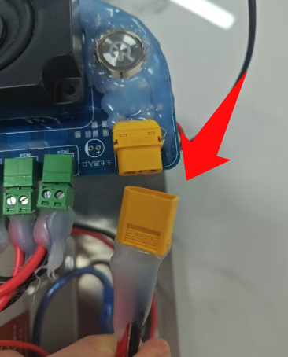
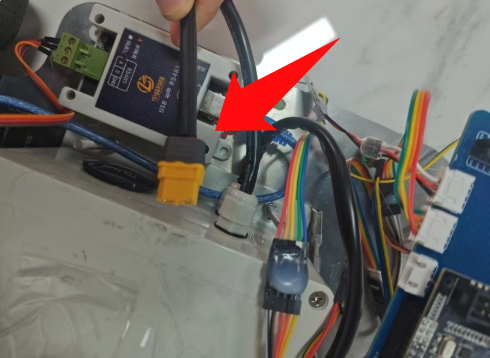

# 如何开机

## 1.检查电源是否正常供电

确保电池有电以及接口正确

电源供电接口

电源充电接口

检测接线无误后，按下绿色按钮，发出绿光则代表正常供电。

**需要注意的是，使用 3d 雷达需要额外使用 12v 锂电池供电，使用 2d 雷达可以使用 usb 直连香橙派。**

## 2.  接线

首先，确保雷达接的是 usb3.0 蓝色接口，否则数据接收可能存在错误。

如果使用 2d 雷达，需要接上 IMU 模块，确保 IMU 的前方 x 与车头方向一致，3d 雷达需要确保雷达数据线的反方向是车头。

确保给香橙派是通过 5v4a 的 typec 供电口插在板卡的 DC 口上，不能插在 Type-c 口上！

确保两路电机的 usb 接口不变，其中拓展坞中间口(上有热熔胶))对应左电机（电路板在前方）。音响和麦克风记得插上。

## 3. 电源模块

我们使用的是 26v 锂电池，使用两个转 24v 模块分别给电机供电，并引出了一路 5v4A 接口给香橙派供电，还有一路 5V1A 接口预留给单片机使用，注意根据丝印来看清楚电源的输入输出。
