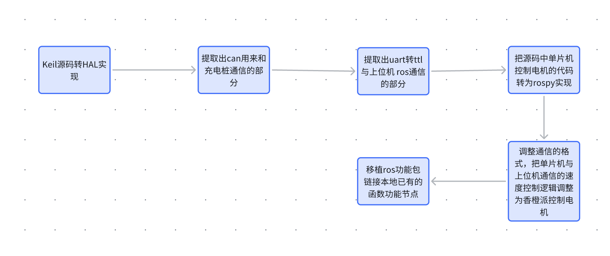

## 1. 电机节点

电机节点位于 `src/service/scripts/motor_control.py`，可以运行 rosrun service key_scans.py 使用键盘控制运动。

该电机使用 usb 转 rs485 进行控制，需要特别注意两个电机的正反转方向，参考代码中的实现。编程手册可以直接搜索欧艾迪编程手册查找。

```
https://oidelec.com/wp-content/uploads/2023/11/F06-%E6%AC%A7%E8%89%BE%E8%BF%AA%E9%A9%B1%E5%8A%A8%E5%99%A8CANOPEN%E7%BC%96%E7%A8%8B%E6%89%8B%E5%86%8Cc.pdf
```

### 需要特别注意的是！！！！！

该编码器的心跳包机制要求至少间隔 500ms 发送一次心跳包给驱动器，而且不能两次相同。而且！两天指令间隔必须大于等于 100ms，否则会触发驱动器看门狗。
文中的代码使用的是一秒发送九个数据包的形式进行电机控制，简单的说是第 1,4,7 帧发送心跳包，第 2 帧发送速度模式设置指令，其余帧发送速度值控制指定，电机运行在速度闭环控制模式下。

### 必须特别注意的是！！！！！

该电机基于 modbus 协议通信，需要确保写线圈，读寄存器，crc 校验等的正确，否则无效指令轻则被电机忽略，严重的话会导致电机自动关闭通信。


## 2. 宇树3d雷达

使用宇树 l2 雷达必须有`src/point_lio_unilidar`,`src/unitree_lidar_sdk`,`src/unitree_lidar_ros`,`src/point_lio_unilidar`

这几个功能包，具体的信息可以在 `ROS 文件分析 `的末尾链接仓库查看。

因为我们使用的是串口来接收雷达的信息，因此有几个地方的配置需要特别注意：`src/unitree_lidar_ros/src/unitree_lidar_ros/config/config.yaml`这个 config 文件下的这两个参数必须这么配置

`initialize_type: 1` `work_mode: 8`。

## 3. 思岚A1雷达

使用二维雷达的话，主要使用 `gmpping` 进行建图，`amcl `进行定位(`src/jie_ware/src/lidar_loc.cpp`这个节点是纯激光数据匹配定位，可以替换 amcl)。导航技术栈 2d 和 3d 都是迪杰斯特拉(全局路径规划) + TEB(局部路径规划)。使用二维雷达进行导航的话需要融合 imu 来提高里程计精度。


## 4. 单片机STM32F407VET6

已经使用 stm32 完成了 sbus 的 rc 遥控数据接收，但是 modbus 电机的控制算法存在小问题（使用 1 秒 9 帧的发送数据包可以解决）。回充套件需要 stm32 通过 can 来接收充电车载装备和充电桩之间的数据，官方提供的源码中电机控制也是在单片机实现的，但是我们是在上位机香橙派实现的，这里提供移植思路如下：


回充套件资料为：

```
 WHEELTEC EC130 自动回充附送资料 链接: https://pan.baidu.com/s/1BcGyfEuJNQ_vHoU0TKT7PQ 已自带加速，直接点击下载即可
```

 电源供电板上已经引出了单片机的供电接口（5v1A），需要将其焊接到电源接口上。
